# London  📕 
# 🇬🇧 💷 ☎️🍺📮
Экспериментирую с форматом: писать отчет по каждому дню выходит долго и утомительно, да и читать тоже.  Пробую накатать текста за несколько дней разом, выделив ключевые моменты/советы как “Заметки” 📕.

- - - -
## Транспорт
Первое о чем подумал прилетев в Хитроу - тут все быстро. Минут через 5-10 я вышел в зал “прибывающие” и начал искать билеты в метро, чтобы доехать в центр. Автоматы с картами бросились сразу на глаза, “инфо-чуваки” пытались всучить мне билет на Экспресс на неудобную для меня станцию, хотя до нужной мне ходило метро без пересадки. В итоге взял карту OYSTER, но как оказалось это штука бесполезна  если у тебя есть карта с Pay Pas или ApplePay - тариф получается точной такой же. 
**📕 Весь транспорт по городу удобней всего оплачивать бесконтактной картой / телефоном** 

Вообще транспортная система в Лондоне оказалась превосходной. Автобусы на небольшие расстояния, метро на расстояния чуть подольше. Все ходит согласно расписанию, почти всегда есть выбор из нескольких вариантов  как добраться до  нужного тебе места. Google Maps тут незаменим: он составляет маршрут с учетом расписания транспорта и пересадок. За счет этого при одних и тех же точках А и Б он часто выдавал мне разные маршруты - учитывал график транспорта. Так же там можно посмотреть timeline: 
**📕  Использовать Google Maps**. 
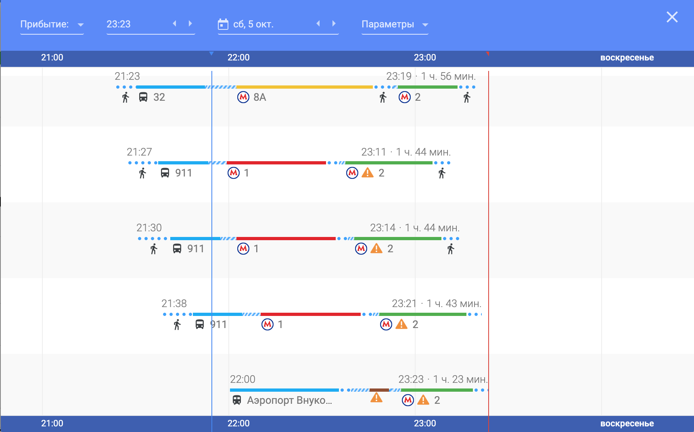
**upd:** Для Москвы как оказалось работает тоже.

Без связи тяжко, навигатор нужен всегда, нашел самое дешевое:
  **📕 Vodafon и 6ГБ интернета за 10￡**

И еще один вывод - расстояния на глаз по карте очень обманчивы. Лондон неимоверно огромный город, там где кажется пройти или проехать совсем не долго - в реальной жизне может занять минут 40. 
 **📕 Проверять расстояния в навигаторе**

Последний момент про транспорт:
**📕  По возможности прилетать/улетать из аэропорта Heathrow**.  Прям из здания аэропорта ходит метро сразу в центр (Peccadilly line), и это супер удобно. (Стоит учесть расписание метро, оно не круглосуточное) . Жена прилетала в Luton - и добираться туда более проблематично: автобусы, которые дороже и ходят реже, едут дольше.

## Деньги
По деньгам - впервые за время всей поездки мне ни разу не понадобилась наличка. Абсолютно все можно было оплатить картой через Apple Pay, был лишь единственный момент когда в автобусе из аэропорта Luton принимали оплату только налом, но : а) купить билет онлайн было даже дешевле, б) ходил параллельный автобус где можно оплатить картой.  
Выходит выгодно открыть счет практический в любой валюте в Тинькофф и перетаскивать свою карту между счетами на время поездок, либо допки сделать.
**📕  Использовать тинькофф-счет в фунтах и ApplePay/карту** 
 P/s/   нет, не реклама.

## Жилье
Жилье в Лондоне больная тема. Дорого. Air b&b порядком дешевле отелей. Еще дешевле комната, а не квартира целиком. По началу это смущало, но по факту оказалось наоборот лучше - можно пообщаться с хозяевами если они дружелюбны, они могут дать советов, подсказать с транспортом, угостить кофе : )
Ночь съема комнаты обошлась ~4500. 

## Город
Лондон - очень стильный город. Делал некоторые замечания, пока впитывал в себя атмосферу в 1ый день:
1. Очень многонациональный город, кажется что местного населения тут в меньшинстве. Но смотрел я на центральные районы, вероятно на окраинах и уж тем более в пригороде дело обстоит иначе.
2. Город очень стильный. Жилые спальные районы отстроены в определённом стиле - там 2 этажа + крыша, возможно с мансардой, фасад лицом к дороге, домики стоят стена к стене, высота домов одинаковая, пример: 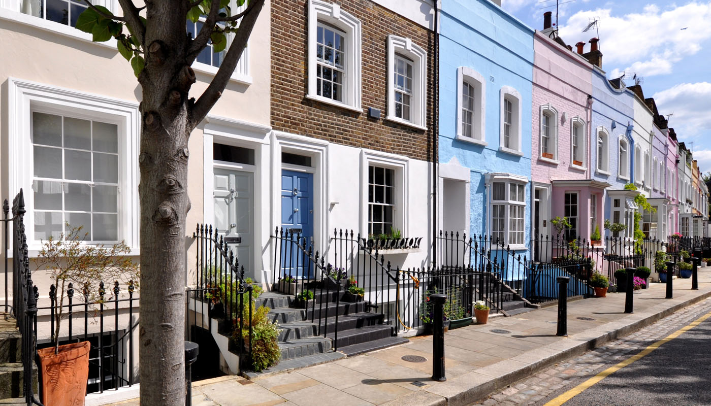
3. Домики могут стоять прям вплотную к железной дороге, самолеты летают низко.
4. Красный - фирменный цвет Лондона. Цвет автобусов (они не туристические а вполне себе для людей), телефонных будок ( с которыми никто не знает что делать), почтовых ящиков (лично видел как ими пользуются) да и вообще где нибудь что-то да покрасят в красный.
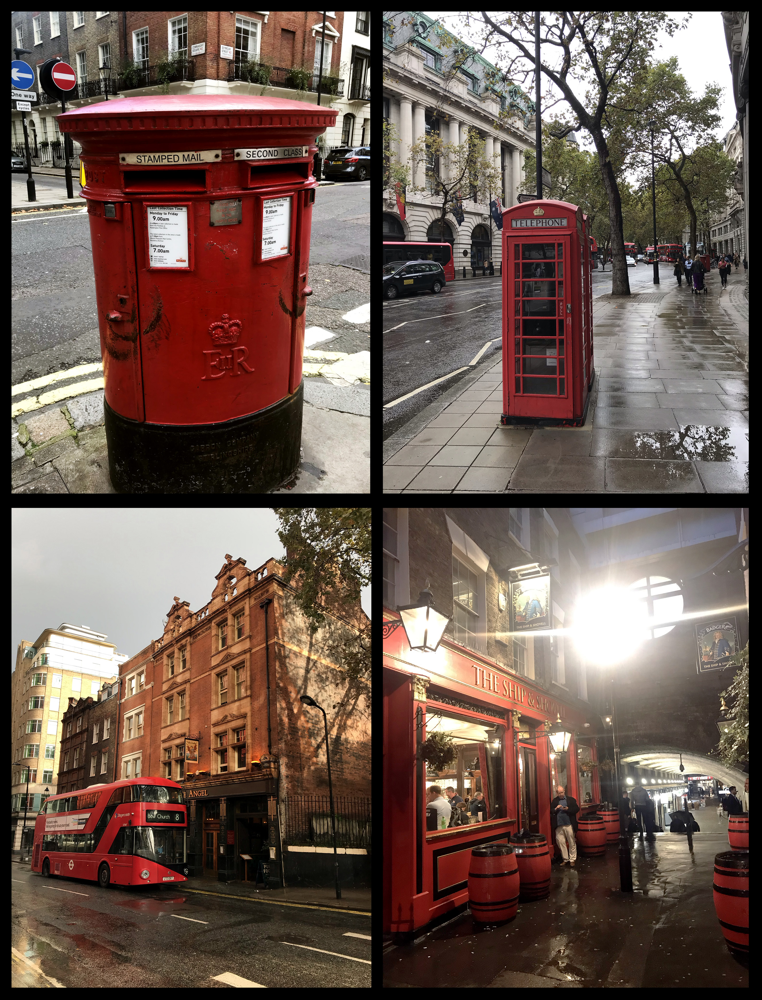

5. Люди выходя из автобусов частенько говорят “Спасибо водитель” : ) Сами водители при этом тоже очень приветливые и улыбчивые, часто.

В Лондоне классные парки. Были в двух - Гайд парк и The Regent’s Park. Большие, ухоженные, ровные, продуманные.  Не могу сказать о них чего-то специфического, но к посещению рекомендовал бы. Еще там жирные и не такие дикие как в Москве белки:)

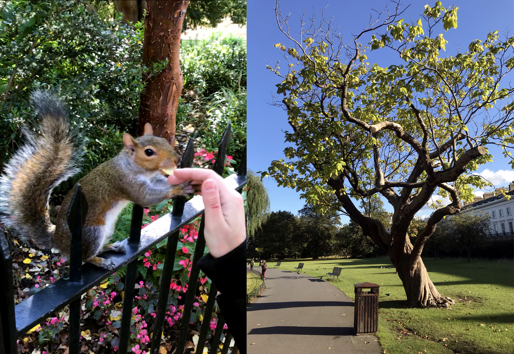

Я не фанат музеев, но судя по картинкам в интернете и по совету знакомых загорелся посетить музей естествознания (Natural History Museum).  Удивился узнав, что вход в большинство музеев Лондона бесплатный. Была оговорка мол “есть платные выставки, но в целом бесплатно”. Ясно, подумал я, самое интересное как обычно окажется платным. Я ошибся. 
Это оказался лучший музей, в котором я был когда либо! Разделен на несколько зон: про динозавров, млекопитающих, рептилий, геологию, про историю планеты и космос. Место обязательно стоит посетить и советую заложить туда не 2-3 часа, а весь день.  Еще там очень много интерактива - есть что потрогать, поиграть. Мы проторчали там с 12 до 18, ушли в буквальном смысле самыми последними (выгнаны, если быть уж совсем честным).
**📕  Заложить один день под музей естествознания**
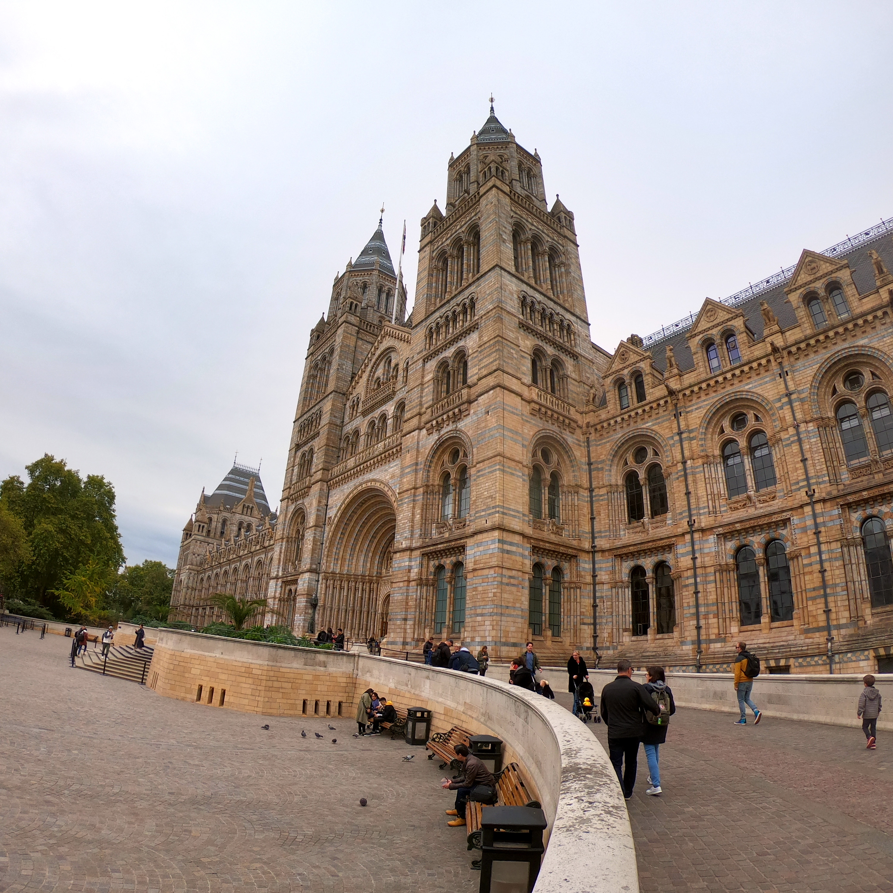
.jpeg)

А вот Британский музей не впечатлил. Вполне себе классический музей с кучей всяких старостей. Там есть очень много всяких штук разных эпох собранных со всего света. Арендодатель даже рассказал шутку, что “Это музей всего наворованного, если бы у моей сестры в Испании пропала люстра я бы не удивился встретив ее в Британском музее.”  А вообще пришли мы туда уставшие, откровенно говоря не самое приятное состояния шарахаться по музею. Там были прикольные старые механическая часы, музыкальные инструменты. Наверное на свежую голову и ноги там можно посмотреть что-нибудь интересное.

Жили мы не в самом центре, но очень от него недалеко, в районе  Fulham около станции Imperial Warf, рядом с Темзой. Арендодатель жилья на Air B&B дал нам наводку - что тут есть вполне себе городской и быстрый водный транспорт, и причал очень близко.  
Выяснил что эти лодки ходят утром и вечером, с интервалом в пол часа и идут прям в центр, и оплатить вход можно так же на месте картой на турникетах. 
Лодка оказалась супер-комфортной и быстрой. Остановка занимает чуть больше времени чем у обычного транспорта, но до Tower’а мы доехали за 50 минут. Это было  примерно так же как было бы на наземном транспорте.  
**📕  Покататься на городском транспорте по Темзе** , порой это может оказаться даже быстрее.

В сам Tower мы не попали, т.к. Вход платный и недешёвый. Вроде как можно записаться заранее за пару месяцев и пройти бесплатно, но такой штуки у нас не было. С  виду это крупная средневековая крепость, внутри все кажется сказочным - виднелся сад, каменные мосты. Заметка:
**📕  Заранее пробить себе бесплатный вход в Tower**.

Еще одна рекомендация сразу с нескольких источников это:
**📕  Посетить  Borough Market**
Это классический рынок. Базар. Там есть куча всякого фастфуда за приемлемее деньги. Продается мясо и сладости, морепродукты, овощи, сыры и трюфеля, хлеба. Рынок довольно крупный и очень людный. В очереди за бургеров отстоять пришлось минут 10.

Borough Double Decker Burger

После долгого дня, с уставшими ногами, провести вечер в баре - это прям как попасть в рай. 
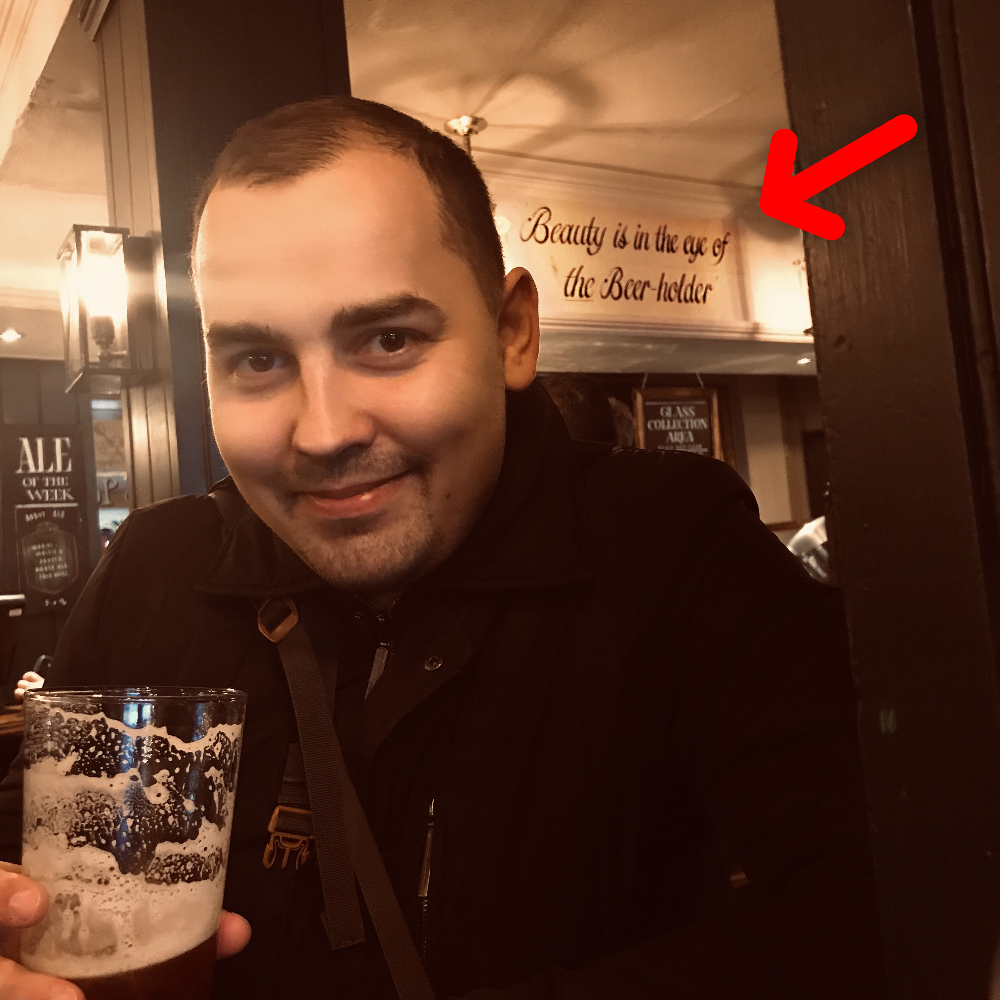

Бары в Лондоне забиты и в выходные и в будни. Люди после работы прибухивают, общаются. В некоторые приходят с собачками.  Одни имеют свое кравтовое пиво другие обычный ассортимент.  Выделю пару понравившихся пабов:
**The lore of the land** - приятное местное, свое зачетное крафтовое пиво, но не было еды. Даже закусок. 
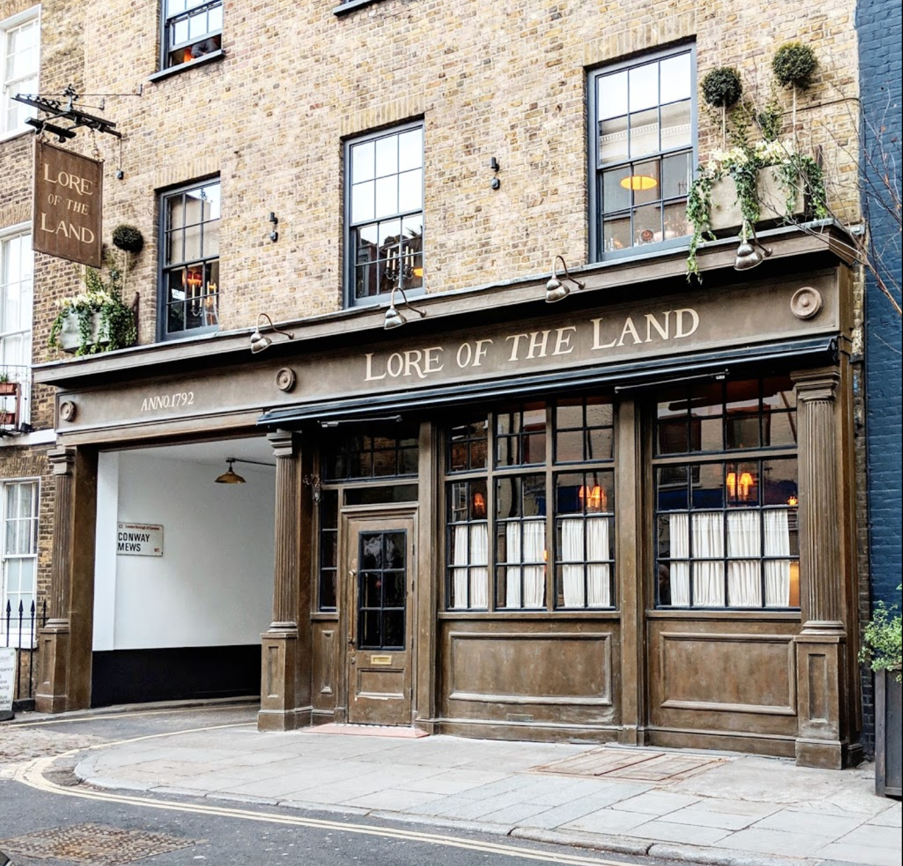
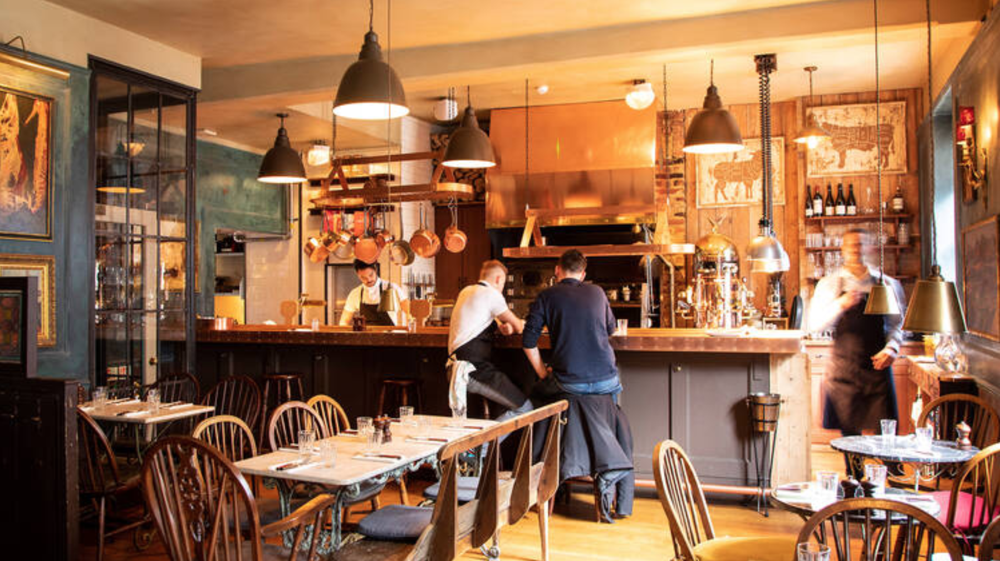

**The Star Tavern** - оч кайфовая нетуристичекская атмосфера. Заценил 3 вида Fuller’a, полюбился. Была барная стойка с местными чуваками в костюмах, молодыми и не очень, которые увлеченно обсуждали сиськи : ) Отменный бургер. 
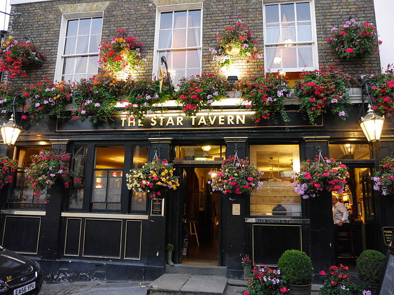
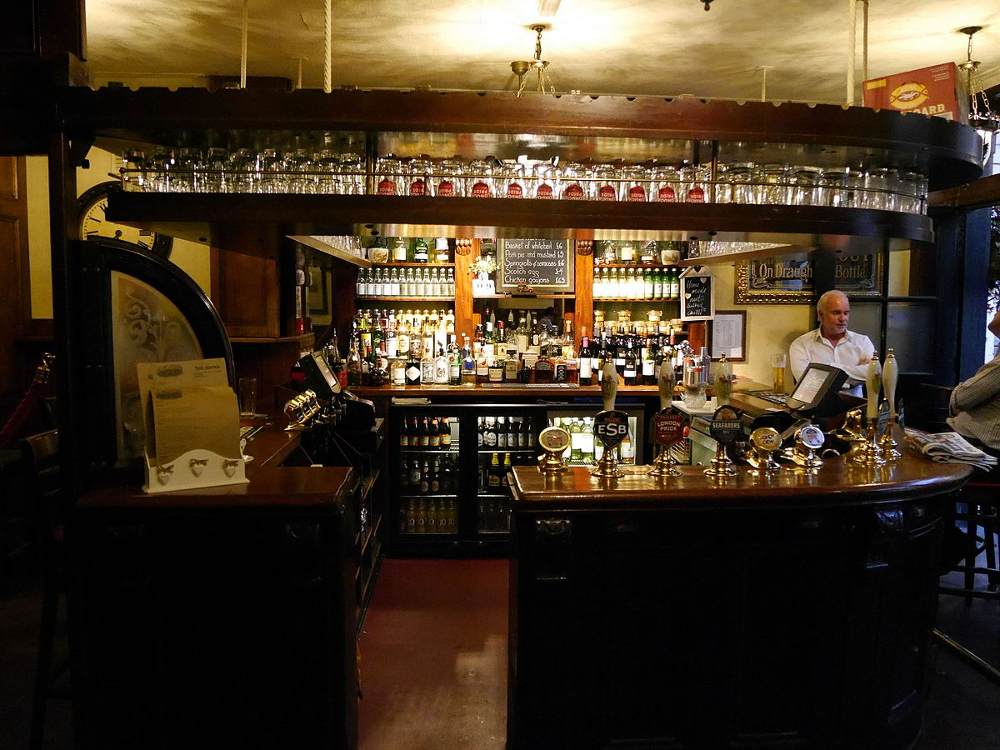

А вообще я заметил  интересную штуку - Trip Adviser для поиска еды работает тут не так круто как Google Maps. Серьезно. Во первых он тупо не находит некоторых прикольных мест, которые есть в гуглокартах, во вторых советует скорее популярные у туристов места.
**📕  искать пабы через Google Maps**

 Вечером можно погулять в районе Leicesture Square. Это что-то вроде местного TimeSquare, с магазинами сладостей (M&Ms World,  какое то сладкое королевство) Жизнь вечером в этом месте просто бурлит
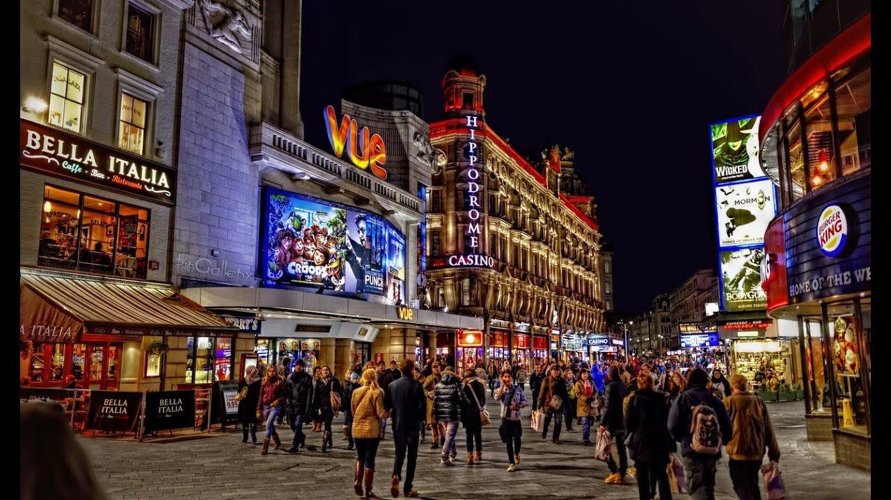

Тут же можно  пройтись по China Town’у
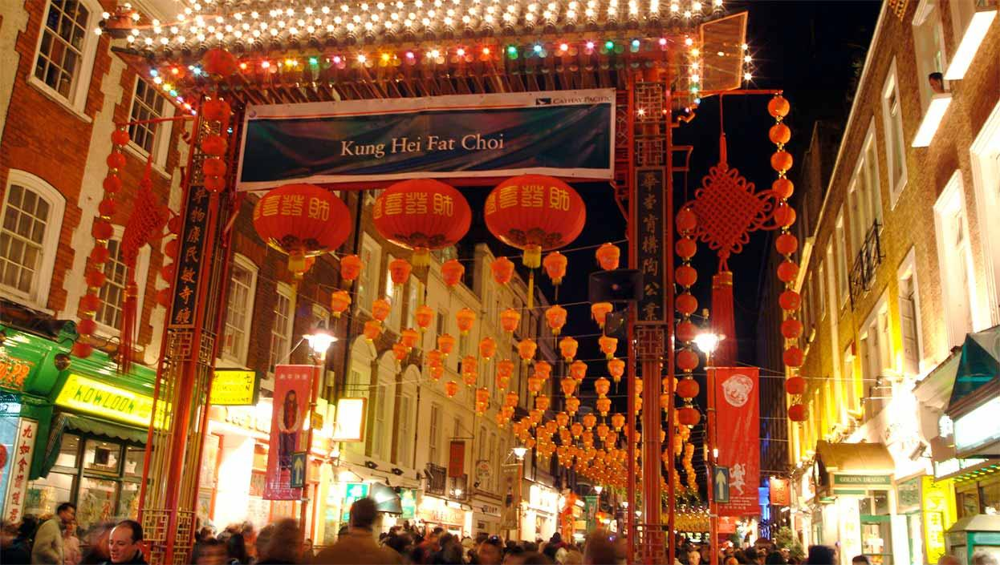

Наверняка там есть еще много всего интересного, но сил обходить все уже не было.

Лондон клевы. Есть там конечно и менее привлекательные вещи - палатки бомжей в центре города. Пару раз видел сумасшедших,  бывает у дороги стоит много мешков мусора. Много строек в городе.  Но это очень стильный город, с приветливыми людьми, 

## Расходы
Вместо этого просто напишу примерные цены, с которыми мы сталкивались:

* Проезд **1 ￡** за поездку, но я как я понял можно упереться в лимит **7 ￡** и дальше деньги списываться не будут. Там же есть система по “зонам”, и перемещения из других зон дороже. Надо вникать.
* Сендвич в супермаркете - **2.4 ￡**. В среднем цены дороже в полтора раза Московских. Просто на вскидку, по ощущениям.
* Пиво в баре - **5-7 ￡**
* Второе блюдо либо бургер в кафешке или в баре **9-12 ￡**
* Жилье **4500 Руб** за ночь в комнате в районе Fullham (зона 2).

#travel